# KURA Protocol

**Confidential Rotating Savings and Credit Association (ROSCA) on Arbitrum Sepolia**

KURA is a production-deployed decentralized savings protocol where contributions, bids, credit scores, votes, membership slots, and circle metadata remain encrypted on-chain using Full Homomorphic Encryption (FHE) via Fhenix Protocol's CoFHE (Collaborative FHE). No plaintext financial amount ever touches the chain during normal operation.

| | |
|---|---|
| **Network** | Arbitrum Sepolia (chainId `421614`) |
| **Deployed** | 2026-05-03 |
| **Live App** | https://kura-gilt.vercel.app |
| **Compiler** | Solidity 0.8.25 · optimizer 200 runs · `viaIR: true` · evmVersion `cancun` |
| **FHE Library** | `@fhenixprotocol/cofhe-contracts v0.1.3` |
| **FHE SDK** | `@cofhe/sdk 0.5.1` |

### At a Glance

| Metric | Value |
|---|---|
| Protocol contracts | **13** |
| Total deployed addresses | **15** |
| FHE operations | **16** across **10** contracts |
| Wave 4 new contracts | **6** |
| Wave 4 updated contracts | **4** |
| Wave 4 new routes / hooks | **8** / **8** |
| Unit tests passing | **86** (15 pending) |
| Wave 5 confirmed live txs | **7** |

---

## Table of Contents

- [Mission & Vision](#mission)
- [Design Principles](#design-principles)
- [Ecosystem Integrations](#ecosystem-integrations)
- [Why KURA Is Not Just An FHE Demo](#why-kura-is-not-just-an-fhe-demo)
- [Key Technical Achievements](#key-technical-achievements)
- [Engineering Challenges Solved](#engineering-challenges-solved)
- [Protocol Architecture](#protocol-architecture)
- [Domain Models](#domain-models)
- [Contract Documentation](#contract-documentation)
- [FHE Operations Reference](#fhe-operations-reference)
- [Frontend](#frontend)
- [Deployment](#deployment)
- [Testing & Production Validation](#testing--production-validation)
- [Security](#security)
- [User Journeys](#user-journeys)
- [Protocol Statistics](#protocol-statistics)
- [Quick Start](#quick-start)

---

## Mission

Enable communities to run rotating savings circles (ROSCAs) on public blockchains without exposing member identities, contribution amounts, bid strategies, credit histories, or governance preferences to observers, validators, or other participants.

## Vision

Make encrypted cooperative finance a first-class primitive: savings pools that behave like traditional ROSCAs in outcome but like zero-knowledge systems in privacy—selective disclosure by default, threshold-governed revelation when aggregates must be published.

## Key Features

- **Encrypted contributions** via confidential USDC (cUSDC) with silent-failure minimum checks
- **Sealed-bid auctions** for round winner selection; losing bids stay private
- **Encrypted credit scoring** with tier proofs, weighted scoring, and quadratic governance weight
- **Encrypted membership registry** with slot-based privacy and encrypted random winner selection (`FHE.rem`)
- **Privacy vault** for encrypted circle names and descriptions (8-byte `euint64` chunks)
- **Stream Pay** for per-block encrypted contribution streams
- **Blind dispute resolution** where admins approve/reject without seeing claimed amounts
- **Encrypted governance voting** with batch threshold decryption of tallies
- **Credit-gated escrow** via ReineiraOS `ConfidentialEscrow` and `KuraConditionResolver`
- **Threshold decryption** through CoFHE network signatures for bids, governance, and winner proofs
- **Permit-based selective disclosure** so only authorized parties decrypt their handles client-side

---

## Ecosystem Integrations

KURA integrates two external FHE ecosystems at the contract layer. Neither is vendored as an npm dependency for escrow—ReineiraOS interfaces are defined inline in KURA Solidity files and wired to pre-deployed Arbitrum Sepolia addresses from `tasks/deploy-kura.ts`.

### Fhenix CoFHE

| Component | Role in KURA |
|---|---|
| `@fhenixprotocol/cofhe-contracts v0.1.3` | On-chain FHE library — `FHE.add`, `FHE.select`, `FHE.lte`, ACL (`FHE.isAllowed`, `FHE.allowThis`, `FHE.allowSender`), threshold verify (`FHE.verifyDecryptResult`, `FHE.verifyDecryptResultBatch`) |
| `@cofhe/sdk 0.5.1` | Client-side encryption, permit-based decryption, threshold signature collection in the frontend |
| CoFHE threshold network | Publishes aggregates only after committee-signed decryption — winning bids, governance tallies, winner identity proofs |

**Used by:** All 10 FHE-enabled KURA contracts; every encrypted write path in the frontend (`encrypt`, `decryptForTx`, `/storage-hub.html` proxy).

### ReineiraOS

| Component | Address | Role in KURA |
|---|---|---|
| **ConfidentialEscrow** | `0xC4333F84F5034D8691CB95f068def2e3B6DC60Fa` | Holds encrypted cUSDC until `IConditionResolver.isConditionMet` returns true |
| **cUSDC** (confidential USDC) | `0x6b6e6479b8b3237933c3ab9d8be969862d4ed89f` | Confidential payment token for contributions, bids, streams, and escrow funding |
| **IConditionResolver** | Interface in `KuraConditionResolver.sol` | Callback API: `onConditionSet`, `isConditionMet` |
| **KuraConditionResolver** | `0xA35d76dbbe380a75777F93C6773A20f5ebAbA744` | KURA implementation — stores `(member, minScore)` per escrow; gates redemption on KuraCredit tier |
| **KuraEscrowAdapter** | `0xaa9814c029302aA3d66C502D2210c456aC3c9aD8` | Bridge from KURA rounds to ConfidentialEscrow |

**Not used:** No other ReineiraOS contracts, libraries, or npm packages appear in this repository. USDC (`0x75faf114eafb1BDbe2F0316DF893fd58CE46AA4d`) is a standard test token for wrap/unwrap only.

#### Why Confidential Escrow Matters

After a sealed-bid round, the pool payout can be locked in ReineiraOS `ConfidentialEscrow` instead of releasing immediately. The escrow owner and amount are encrypted (`InEaddress`, `InEuint64`). Funds stay confidential until redemption conditions pass.

#### Conditional Redemption Flow

```
Admin: KuraEscrowAdapter.createWinnerEscrow(circleId, round, winner, minCreditScore, encWinner, encPoolAmount)
  → ConfidentialEscrow.create(encOwner, encAmount, KuraConditionResolver, abi.encode(winner, minScore))
  → KuraConditionResolver.onConditionSet(escrowId, data)

Admin: KuraEscrowAdapter.fundEscrow(circleId, round, encAmount)
  → ConfidentialEscrow.fund(escrowId, encPayment)

Winner: KuraEscrowAdapter.claimEscrow / claimAndUnwrap / claimEscrowWithProof
  → ConfidentialEscrow.redeem(escrowId)
  → KuraConditionResolver.isConditionMet(escrowId)  // tier >= required tier from minScore
```

**Credit-gated logic:** `KuraConditionResolver.isConditionMet` reads `KuraCredit.getCreditStats(member)` and maps `minScore` to tier thresholds (5→Bronze, 15→Silver, 30→Gold, 50→Diamond). Redemption succeeds only when `tier >= requiredTier`.

**Privacy-preserving settlement:** `claimEscrowWithProof` uses `FHE.eq(eaddress)` + `FHE.verifyDecryptResult(isWinner, true, sig)` so the winner can self-claim without the admin passing a plaintext winner address at claim time.

#### Protocol Features That Depend on ReineiraOS

| Feature | ReineiraOS dependency |
|---|---|
| Encrypted contributions / pool | **cUSDC** via KuraCircle, KuraBid, KuraStreamPay |
| Credit-gated winner payout | **ConfidentialEscrow** + **KuraConditionResolver** via **KuraEscrowAdapter** |
| Confidential settlement | Encrypted escrow owner/amount; redeem stays on ciphertext until unwrap |

#### Frontend & Test Coverage

| Surface | Status |
|---|---|
| `useKuraEscrowAdapter.ts` | Exposes `getEscrowId`, `isClaimed`, `claimEscrow`, `claimAndUnwrap` — hook defined, not yet wired to a route |
| `useAutoSettler.ts` | Production round advance uses `KuraCircle.transferPool` (direct encrypted transfer), not `createWinnerEscrow` |
| `createWinnerEscrow` / `fundEscrow` | Admin-only; in deployed ABI, no frontend hook |
| Unit tests | No `KuraEscrowAdapter` or `KuraConditionResolver` test files in `test/` |
| Wave 5 live txs | 7 confirmed workflows; none are escrow create/fund/claim transactions |

KuraBid `settleRound` and escrow creation are **separate admin steps** — there is no on-chain call from KuraBid to KuraEscrowAdapter.

---

## Protocol Overview

KURA implements a multi-round ROSCA: members join a circle, contribute encrypted cUSDC each round, optionally bid for early pool access, and receive payouts according to encrypted round order or auction outcome. Credit reputation accumulates in encrypted form. Wave 4 completes the FHE privacy layer across 10 FHE-enabled contracts using all 16 specified CoFHE operations.

### Why KURA Exists

Billions of people participate in informal rotating savings circles globally. On-chain ROSCAs promise transparency and enforceability but leak the very information—who saved how much, who bid what, who is trusted—that makes participants vulnerable to targeting, coercion, and competitive disadvantage.

### Why Traditional ROSCA Systems Fail On-Chain

| Failure Mode | On-Plaintext Chain Behavior |
|---|---|
| Contribution surveillance | Every transfer amount is public |
| Bid strategy leakage | Sealed bids become public bids |
| Reputation doxing | Credit scores become permanent public records |
| Membership enumeration | `MemberJoined` events expose participant sets |
| Governance coercion | Individual votes are traceable |
| Timing analysis | Lump-sum transfers reveal payment schedules |

### How KURA Solves The Problem

KURA stores financial state as FHE ciphertext handles (`euint64`, `ebool`, `eaddress`). Contracts compute on encrypted values. Plaintext appears only when explicitly published via CoFHE threshold decryption with verified signatures. Events deliberately omit addresses and amounts where privacy matters. Members decrypt their own data using wallet-bound permits.

### Why FHE Changes Everything

Unlike commit-reveal or hash-based schemes, FHE allows the chain to **compute** on encrypted data—compare bids, accumulate pools, verify tier ranges, select random slots—without decrypting inputs. Encrypted state persists across transactions; privacy is structural, not procedural.

### Why CoFHE

CoFHE (Collaborative FHE) by Fhenix Protocol provides:

- On-chain FHE operations via `@fhenixprotocol/cofhe-contracts`
- Client-side encryption/decryption via `@cofhe/sdk`
- **Threshold decryption network**: plaintext results require committee signatures verified on-chain via `FHE.verifyDecryptResult` / `FHE.verifyDecryptResultBatch`
- **ACL system**: `FHE.allow`, `FHE.allowSender`, `FHE.isAllowed` control who may decrypt which handles

---

## Design Principles

KURA is engineered around five principles that govern every contract and frontend interaction:

| Principle | Implementation |
|---|---|
| **Privacy by default** | Financial state stored as FHE handles; no plaintext amounts in normal operation |
| **Selective disclosure** | `FHE.allowSender`, `FHE.isAllowed`, and wallet-bound permits control who decrypts what |
| **Threshold publication** | Aggregates (bid results, vote tallies) revealed only via CoFHE-signed `verifyDecryptResult(Batch)` |
| **Confidential coordination** | Pools, bids, votes, and streams computed homomorphically without intermediate decryption |
| **Silent failure where revealing** | Under-minimum contributions and double bids succeed without leaking failure reason |

> **Privacy is structural, not procedural.** Encrypted handles persist across transactions. Observers see ciphertext and events stripped of sensitive fields—not hashes waiting for a reveal phase.

---

## Why KURA Is Not Just An FHE Demo

Most FHE hackathon projects encrypt a single value, perform one operation, and call it a protocol. KURA is a full cooperative finance stack.

| Typical FHE Demo | KURA Protocol |
|---|---|
| One encrypted transfer | Multi-round ROSCA with encrypted pool accumulation |
| Single `FHE.add` showcase | **16 operations** across **10 contracts** |
| Client-only encryption | On-chain homomorphic bid comparison, tier proofs, stream math |
| Manual decrypt for display | Threshold-governed publication with signature verification |
| No production frontend | Live Vercel deployment with **13 verified workflows** on Arbitrum Sepolia |
| No cross-contract privacy | Credit-gated escrow via ReineiraOS `ConfidentialEscrow` |
| No governance or disputes | Encrypted voting, blind dispute resolution, absence proofs |

KURA spans the complete ROSCA lifecycle—create, join, contribute, bid, settle, escrow, govern, dispute, stream, and vault—each step preserving confidentiality where plaintext chains would not.

---

## Key Technical Achievements

- **Full FHE operation suite:** All 16 specified CoFHE operations deployed and tested, including Wave 4 additions `FHE.rem`, `FHE.not`, and `FHE.verifyDecryptResultBatch`
- **Production deployment:** 15 contract addresses on Arbitrum Sepolia, verified deploy pipeline, frontend at https://kura-gilt.vercel.app
- **Live validation (Wave 5):** 7 confirmed on-chain transactions, 13 verified workflows, 7 production fix commits
- **Compiler hardening:** `viaIR: true` resolves stack-too-deep in encrypted tier selection; 7 Wave 4 contract bug fixes shipped
- **Frontend integration:** CoFHE storage iframe proxy, full `InEuint64`/`InEbool` ABI tuples, dynamic gas fee handling
- **ReineiraOS integration:** Credit-gated confidential escrow with privacy-preserving winner self-claim via `FHE.eq(eaddress)`

---

## Engineering Challenges Solved

| Challenge | Symptom | Resolution |
|---|---|---|
| **FHE ACL management** | Unauthorized handle reads | `FHE.isAllowed` guards; `allowThis` before `allow`; non-view on ACL-reading functions |
| **Threshold decryption verification** | Forged plaintext acceptance | `verifyDecryptResult` / `verifyDecryptResultBatch` with CoFHE committee signatures |
| **Encrypted input ABI handling** | `status=0x0` reverts on live txs | Full tuple `(ctHash, securityZone, utype, signature)` — commit `e845ed7` |
| **Storage iframe issues** | 30s timeout blocking encryption | App-origin proxy at `/storage-hub.html` — commit `94efd68` |
| **Gas fee issues** | RPC rejection below `baseFee` | Shared `getGasFees(publicClient)` on Wave 5 write hooks — commit `2540ecc` |
| **Encrypted random selection** | Slot-mapping attacks | `FHE.rem(rand, encCount)` in KuraMemberRegistry |
| **Blind dispute resolution** | Admin seeing claim amounts | Admin receives `ebool` from `checkDisputeValidity` only |
| **Confidential escrow integration** | Winner identity leakage | `claimEscrowWithProof` via encrypted address equality + threshold sig |
| **COOP/COEP headers** | Wallet and iframe breakage | Removed from `vercel.json` — commit `d25c245` |
| **Solidity reserved keyword** | Compile failure on `match` | Renamed to `isMatch` in KuraMemberRegistry |
| **Tuple return unpacking** | Wrong bid amount reads | `(uint64 result, ) = FHE.getDecryptResultSafe(...)` in KuraBid |
| **Bool vs integer verify** | Invalid winner proofs | `verifyDecryptResult(isWinner, true, sig)` not `1` |

---

## Protocol Architecture

### High-Level Architecture

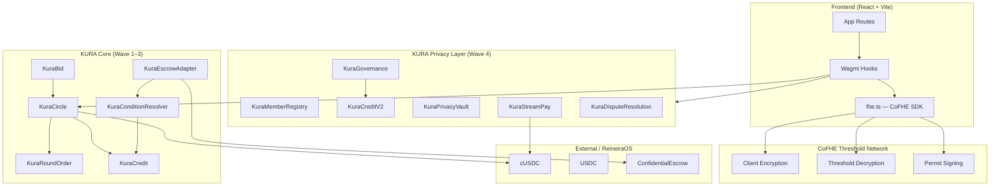

### Contract Architecture

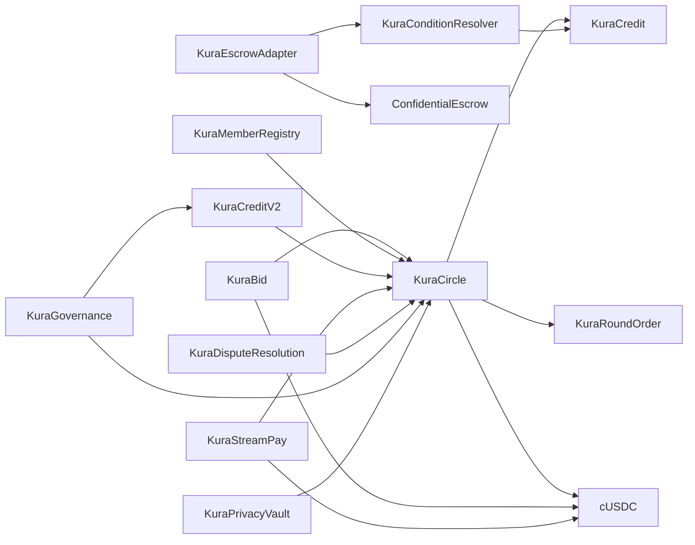

### CoFHE Architecture

CoFHE splits responsibility across three layers: client encryption, on-chain homomorphic computation, and threshold-governed decryption.

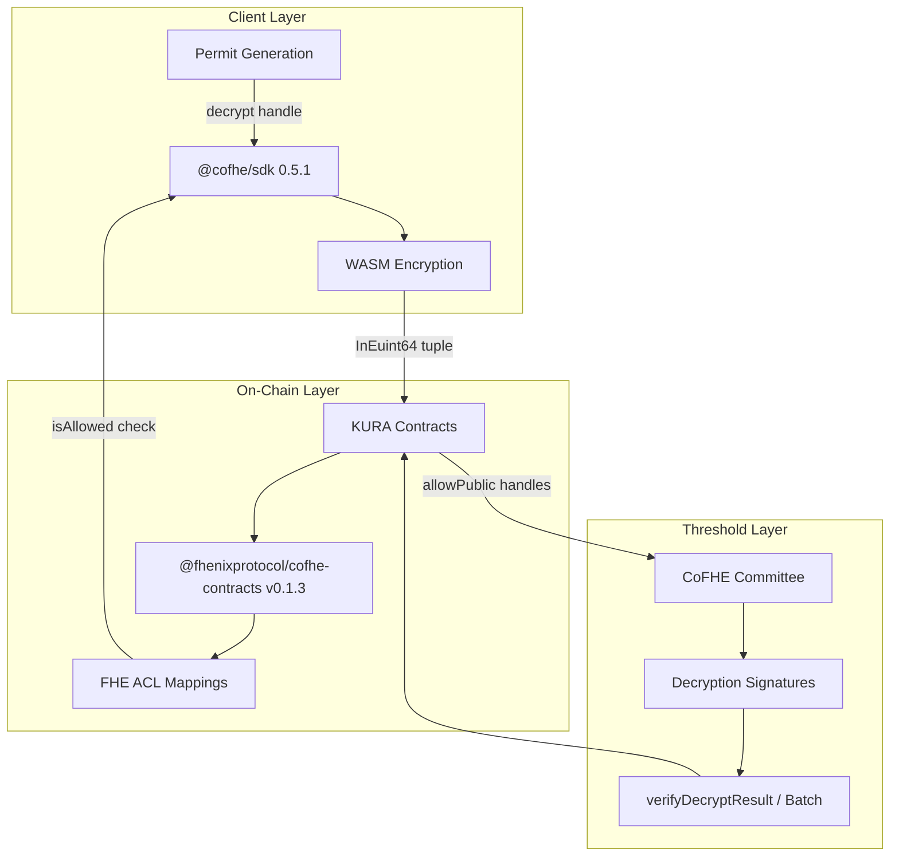

**Write path:** Client encrypts → full struct submitted → contract imports via `FHE.asEuint64` → ACL grants established.

**Read path:** Contract returns handle → user obtains permit → CoFHE decrypts client-side.

**Publish path:** Admin calls `allowPublic` → threshold network decrypts off-chain → signature verified on-chain before plaintext stored.

### User Flow

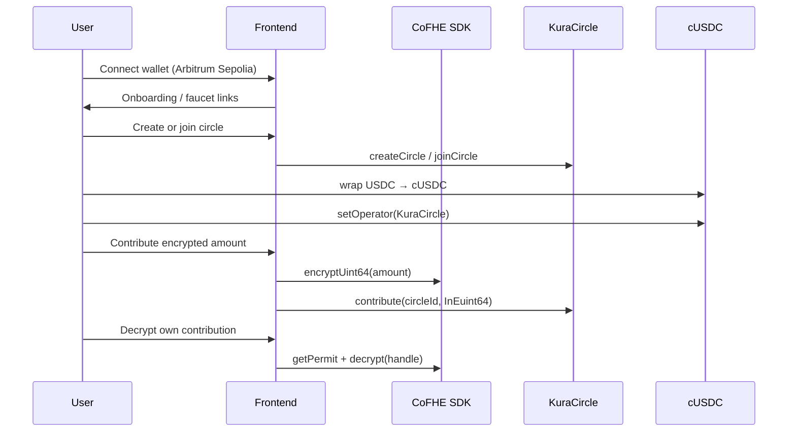

### Contribution Flow

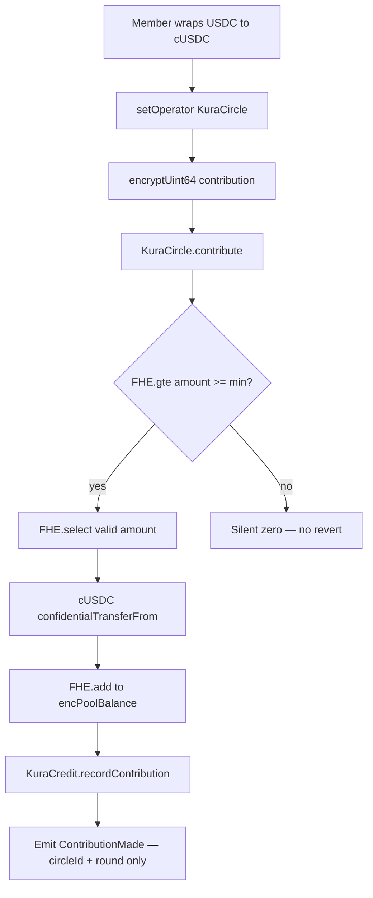

### Governance Flow

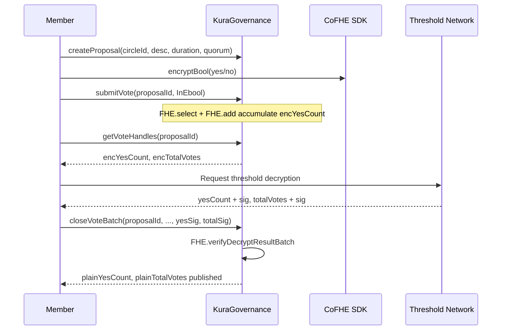

### Credit Flow

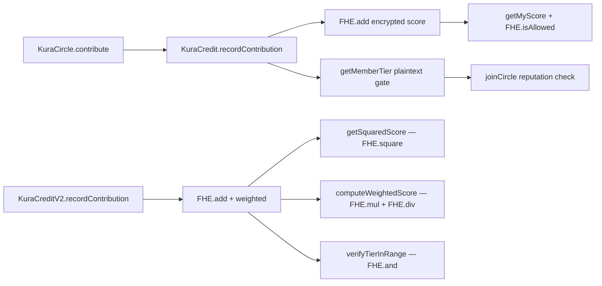

### Escrow Flow

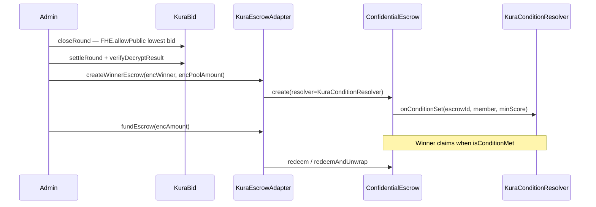

### Privacy Vault Flow

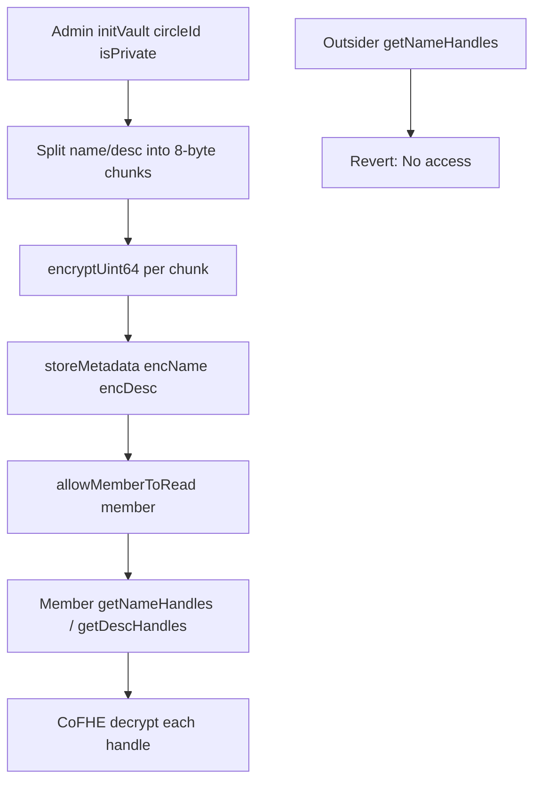

### Stream Pay Flow

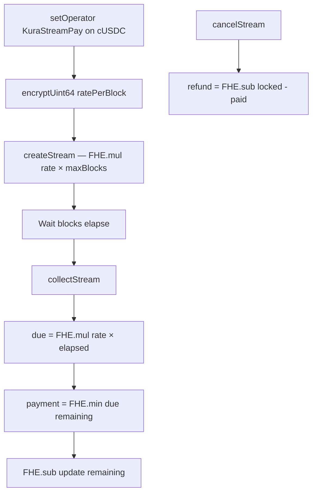

### Dispute Flow

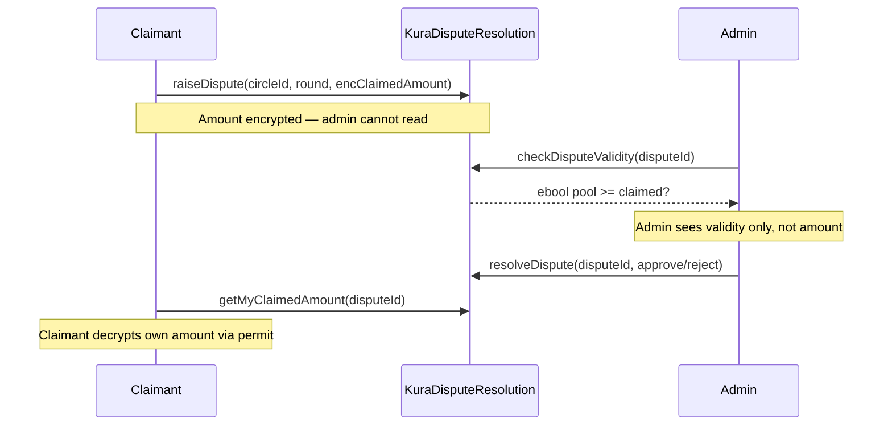

### Member Registry Flow

```mermaid
flowchart TD
    A[KuraCircle.registerMember] --> B[Encrypted eaddress slot stored]
    B --> C{Outsider queries isMember?}
    C --> D[Returns single ebool — no slot revealed]
    E[Member allowMemberSelf] --> F[getEncMemberSlot via isAllowed]
    F --> G[Decrypt own address via permit]
    H[getRandomSlotIndex] --> I[FHE.rem rand mod encCount]
    I --> J[Encrypted winner slot — count not leaked]
```

### Decryption Flow

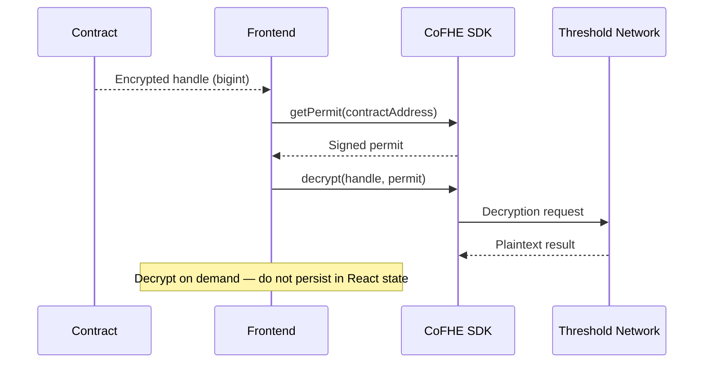

### CoFHE Interaction Flow

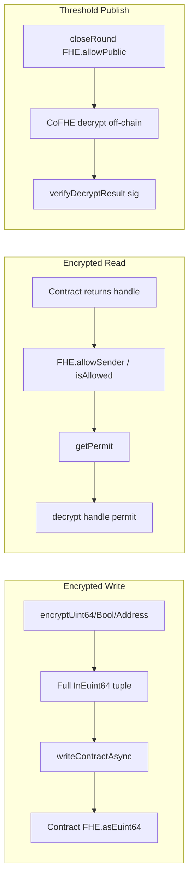

### Permission Flow

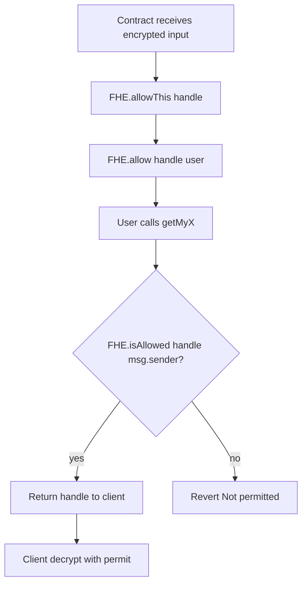

---

## Domain Models

Each KURA subsystem defines a distinct privacy boundary, dependency graph, and publication rule.

### Privacy Model (Protocol-Wide)

| Data Class | On-Chain Representation | Who Can Decrypt | Publication Rule |
|---|---|---|---|
| Contributions | `euint64` pool + per-member handles | Member (own), admin (pool) | Events emit circleId + round only |
| Bids | `euint64` per bidder; lowest tracked homomorphically | Bidder (own); public after `closeRound` (winner bid only) | Losing bids never published |
| Credit scores | `euint64` encrypted score | Member via `getMyScore` + ACL | Tier stats plaintext for gating only |
| Votes | Encrypted counters, not individual votes | Admin gets handles for threshold close | Tally published after batch verify |
| Membership | `eaddress` slots | Member via `allowMemberSelf` | `isMember` returns ebool, not slot index |
| Metadata | `euint64[]` chunks | Members with vault access | Outsiders revert on private circles |

### Credit Model

KuraCredit (Wave 1) and KuraCreditV2 (Wave 4) form a two-layer reputation system:

- **KuraCredit:** Base encrypted scoring, tier thresholds (Bronze 5 / Silver 15 / Gold 30 / Diamond 50), join-gate via `getMemberTier`, double-blind `verifyCreditworthiness`
- **KuraCreditV2:** Weighted scoring (`FHE.mul` + `FHE.div`), quadratic governance weight (`FHE.square`), tier range proofs (`FHE.and`), encrypted tier buckets

Credit gates circle joins, escrow redemption (via KuraConditionResolver), and governance weight.

### Governance Model

Encrypted homomorphic vote accumulation—individual votes are never stored on-chain:

1. Member submits `InEbool` encrypted yes/no
2. Contract accumulates via `FHE.select` + `FHE.add` into `encYesCount` / `encTotalVotes`
3. After deadline, admin retrieves handles and submits to CoFHE threshold network
4. `closeVoteBatch` verifies both ciphertexts in one call (~30% less gas than dual verify)
5. Non-voters prove absence via `getEncVoteAbsenceProof` (`FHE.not`)

Proposal IDs start at `1` (Wave 5 frontend fix).

### Escrow Model

Post-auction pool payouts can flow through ReineiraOS confidential escrow (deployed and integrated at contract level):

```
KuraBid.settleRound (separate admin tx)
  → KuraEscrowAdapter.createWinnerEscrow → ConfidentialEscrow.create
  → KuraConditionResolver.onConditionSet(escrowId, member, minScore)
  → KuraEscrowAdapter.fundEscrow(encAmount)
  → winner claimEscrow / claimEscrowWithProof when isConditionMet
```

The production frontend auto-settler (`useAutoSettler`) currently advances rounds via `KuraCircle.transferPool` — a direct encrypted cUSDC transfer to the winner. The ReineiraOS escrow path is available on-chain for credit-gated confidential settlement but is not yet orchestrated in that hook.

Winner self-claim path: `claimEscrowWithProof` uses `FHE.eq(eaddress)` + `verifyDecryptResult(true, sig)` so admin never needs to pass winner at claim time.

### StreamPay Model

Per-block encrypted streams decouple contribution timing from lump-sum visibility:

| State | Encrypted | Plaintext |
|---|---|---|
| Rate per block | Yes | — |
| Locked total (rate × maxBlocks) | Yes | — |
| Remaining balance | Yes | — |
| Paid accumulated | Yes (member read) | — |
| Start block, max blocks, active flag | — | Yes |

Collection computes `due = rate × elapsed`, caps via `FHE.min(due, remaining)`, updates via `FHE.sub`.

### Member Registry Model

Parallel encrypted membership layer—distinct from KuraCircle's plaintext member list:

- Members stored as encrypted `eaddress` in indexed slots
- `isMember(circleId, addr)` OR-accumulates `FHE.eq` across slots without revealing which matched
- `getRandomSlotIndex` uses `FHE.rem` for encrypted winner selection
- **Wave 5 finding:** Circle `#0` registry count may be `0` until `registerMember` called; disable slot reads when empty

### Privacy Vault Model

Circle metadata stored as encrypted 8-byte `euint64` chunks:

- Admin initializes vault, sets private/public flag
- Name and description chunked (e.g. `"KURA"` → `0x4b55524100000000`)
- `allowMemberToRead` grants FHE ACL on all chunks
- `revokeMemberAccess` soft-revokes UI flag; FHE ACL persists
- Outsiders calling `getNameHandles` revert with `"No access"`

> **Wave 4 additions summary:** Six new contracts (MemberRegistry, CreditV2, PrivacyVault, StreamPay, DisputeResolution, Governance), three new FHE ops (rem, not, verifyDecryptResultBatch), eight frontend routes, eight hooks, seven contract bug fixes.

---

## Contract Documentation

KURA deploys **13 protocol contracts** plus **cUSDC**, **USDC**, and **ConfidentialEscrow** (ReineiraOS). Wave 4 added **6 new contracts** and **updated 4** existing contracts.

| Classification | Count | Contracts |
|---|---|---|
| Wave 4 new | 6 | KuraMemberRegistry, KuraCreditV2, KuraPrivacyVault, KuraStreamPay, KuraDisputeResolution, KuraGovernance |
| Wave 1–3 updated (Wave 4 fixes) | 4 | KuraCredit, KuraBid, KuraEscrowAdapter, KuraMemberRegistry |
| Wave 1–3 core | 6 | KuraCircle, KuraRoundOrder, KuraBid, KuraCredit, KuraConditionResolver, KuraEscrowAdapter |
| External | 3 | ConfidentialEscrow, cUSDC, USDC |

### Contract Dependency Matrix

| Contract | Depends On |
|---|---|
| KuraCircle | KuraCredit, cUSDC, KuraRoundOrder |
| KuraRoundOrder | KuraCircle (caller) |
| KuraBid | KuraCircle, cUSDC |
| KuraCredit | Authorized callers (KuraCircle) |
| KuraCreditV2 | KuraCircle, KuraGovernance |
| KuraConditionResolver | KuraCredit, ConfidentialEscrow |
| KuraEscrowAdapter | ConfidentialEscrow, KuraCircle, cUSDC, KuraConditionResolver |
| ConfidentialEscrow | KuraConditionResolver (via adapter), cUSDC |
| KuraMemberRegistry | KuraCircle (registers members) |
| KuraPrivacyVault | Circle admin (init) |
| KuraStreamPay | cUSDC, KuraCircle |
| KuraDisputeResolution | KuraCircle pool handles |
| KuraGovernance | KuraCircle membership, KuraCreditV2 |

---

### KuraCircle

**Address:** `0x5B2DBDCC210Df55486BdBc7E1A16B1f8CF0673b7`

| | |
|---|---|
| **Purpose** | Core ROSCA engine: circle lifecycle, encrypted contributions, pool management, round progression |
| **Responsibilities** | Create/join circles, start rounds, accept encrypted cUSDC contributions, transfer pool to winners, reputation gating |
| **Dependencies** | KuraCredit, cUSDC, KuraRoundOrder |
| **Security model** | Admin-only round start and pool transfer; member-only contribute; silent failure on under-minimum contributions |
| **Privacy model** | `ContributionMade` emits circleId + round only; pool balances encrypted; min contribution encrypted |

**FHE operations:** `FHE.mul` (pool target = minContrib × memberCount), `FHE.gte`, `FHE.select`, `FHE.add`, `FHE.asEuint64`, `FHE.allowThis`, `FHE.allow`, `FHE.allowTransient`

**Key public functions:**

| Function | Description |
|---|---|
| `createCircle(maxMembers, roundDuration, totalRounds, encMinContribution, minCreditTier)` | Creates circle; admin auto-joins; registers in KuraRoundOrder |
| `joinCircle(circleId)` | Join if tier gate passes; registers in round order |
| `startRound(circleId)` | Admin starts round; computes encrypted pool target |
| `contribute(circleId, InEuint64)` | Encrypted cUSDC contribution with silent minimum check |
| `transferPool(circleId, winner, amount)` | Admin transfers encrypted pool to winner |
| `checkPoolFull(circleId)` | Returns `ebool`: pool ≥ target |
| `getCircleInfo`, `getMembers`, `getPoolBalanceHandle` | Circle state queries |

**Typical flow:** Create circle → members join → admin starts round → members setOperator + contribute → bid/settle → transferPool → repeat until completed → `recordCircleCompletion` for all members.

---

### KuraRoundOrder

**Address:** `0x7204C03033ad8FfBAFfdE9313fd14cAF0Df7182a`

| | |
|---|---|
| **Purpose** | Encrypted fair payout ordering for circle members |
| **Responsibilities** | Register members per circle, assign encrypted position handles |
| **Dependencies** | KuraCircle (immutable caller) |
| **Security model** | `onlyKuraCircle` modifier; max 200 members |
| **Privacy model** | Positions stored as `euint8`; members decrypt own position via permit |

**FHE operations:** `FHE.randomEuint8`, `FHE.add`, `FHE.asEuint8`, **`FHE.allowSender`** (in `getMyPositionHandle`), `FHE.allowThis`, `FHE.allow`

**Key public functions:**

| Function | FHE | Description |
|---|---|---|
| `registerMember(circleId, member)` | — | Called by KuraCircle on join |
| `assignOrder(circleId)` | add | Assigns encrypted position = base + offset per member |
| `getMyPositionHandle(circleId)` | allowSender | Returns position; grants caller decrypt access |
| `getPositionHandle(circleId, member)` | — | View encrypted handle |
| `getMembers`, `getMemberCount` | — | Member list queries |

**Typical flow:** Members register on join → admin triggers `assignOrder` once → each member calls `getMyPositionHandle` and decrypts to learn payout order.

---

### KuraBid

**Address:** `0x0179416EfeD421aB3582B2b4Cb238450d60A9Af1`

| | |
|---|---|
| **Purpose** | Sealed-bid auction for round winner selection (lowest discount bid wins) |
| **Responsibilities** | Accept encrypted bids, track lowest bid encrypted, close round, verify threshold decryption on settle |
| **Dependencies** | KuraCircle, cUSDC |
| **Security model** | Admin-only close/settle; silent failure on double bid |
| **Privacy model** | Losing bids never published; only lowest bid + winner address become publicly decryptable after `closeRound` |

**FHE operations:** `FHE.lte`, `FHE.select`, **`FHE.verifyDecryptResult`** (in `settleRound`), **`FHE.getDecryptResultSafe`** (in `getSettledBidAmount` — tuple unpack required), `FHE.allowPublic`, `FHE.asEaddress`

**Key public functions:**

| Function | Description |
|---|---|
| `submitBid(circleId, round, InEuint64)` | Submit encrypted sealed bid |
| `closeRound(circleId, round)` | Admin publishes lowest bid + winner enc address for decryption |
| `settleRound(circleId, round, winner, winningBidPlaintext, sig)` | Verifies CoFHE signature on lowest bid |
| `getSettledBidAmount(circleId, round)` | Reads published decryption: `(uint64 result, ) = getDecryptResultSafe(...)` |
| `getLowestBidderEncHandle(circleId, round)` | Encrypted winner address for AutoSettler |

**Wave 4 bug fix:** `getSettledBidAmount` now correctly unpacks `FHE.getDecryptResultSafe` tuple.

**Typical flow:** Members submit encrypted bids → admin closes round → CoFHE decrypts lowest bid → admin settles with verified signature → winner determined.

---

### KuraCredit

**Address:** `0xF6e42A0523373F6Ef89d91E925a4a93299b75144`

| | |
|---|---|
| **Purpose** | Wave 1 encrypted credit scoring and tier gating |
| **Responsibilities** | Accumulate encrypted scores, record contributions/completions, verify creditworthiness |
| **Dependencies** | Authorized callers (KuraCircle) |
| **Security model** | `onlyAuthorized` for writes; member/verifier for tier reads |
| **Privacy model** | Scores encrypted; plaintext stats for tier display only |

**FHE operations:** `FHE.add`, `FHE.gte`, `FHE.select`, `FHE.asEuint64`, **`FHE.isAllowed`** (in `getMyScore`)

**Tier thresholds:** Bronze 5, Silver 15, Gold 30, Diamond 50

**Key public functions:**

| Function | Description |
|---|---|
| `recordContribution(member)` | +1 encrypted score (authorized) |
| `recordCircleCompletion(member)` | +5 encrypted score |
| `verifyCreditworthiness(member, encThreshold)` | Returns `ebool` — double-blind check |
| `verifyCreditworthinessPlain(member, threshold)` | Contract-to-contract FHE gte |
| `getMyScore()` | Member reads own score — **non-view** (Wave 4 fix) |
| `getEncryptedTier(member)` | FHE.select chain for tier 0–4 |
| `getMemberTier(member)` | Plaintext tier for join gates |

**Wave 4 bug fix:** Removed `view` from `getMyScore()` — `FHE.isAllowed` reads ACL state.

**Stack fix:** `getEncryptedTier` required `viaIR: true` in compiler settings.

---

### KuraCreditV2

**Address:** `0x5fBc73FBBD343132483710AEA444aE3AD778a339`

| | |
|---|---|
| **Purpose** | Enhanced credit with quadratic voting, weighted scoring, tier range proofs |
| **Responsibilities** | Weighted score computation, squared score for governance, encrypted tier with range verification |
| **Dependencies** | KuraCircle (authorized), KuraGovernance |
| **Security model** | Authorized recorders; member self-read via ACL |
| **Privacy model** | Scores and tiers encrypted; range proofs without score revelation |

**FHE operations:** `FHE.add`, `FHE.mul`, `FHE.div`, `FHE.square`, `FHE.and`, `FHE.select`, **`FHE.allowSender`**, **`FHE.isAllowed`**

| Function | FHE Op | Description |
|---|---|---|
| `recordContribution(member, amount)` | add | Accumulates encrypted score (kuraCircle only) |
| `computeWeightedScore(member, weight)` | mul + div | `(score × weight) / 100` |
| `getSquaredScore(member)` | square | Returns score² for quadratic governance |
| `verifyTierInRange(member, lo, hi)` | and | `gte AND lte` without revealing score |
| `allowMeTier(member)` | allowSender | Grant tier handle access |
| `getEncryptedTier(member)` | select + isAllowed | Tier 0–3 encrypted |
| `getMyScore()` | isAllowed | Member reads own score — **non-view** |

**Typical flow:** Contributions recorded → member gets squared score for governance weight → `verifyTierInRange` for bracket proofs.

---

### KuraConditionResolver

**Address:** `0xA35d76dbbe380a75777F93C6773A20f5ebAbA744`

| | |
|---|---|
| **Purpose** | ReineiraOS `IConditionResolver` — gates escrow redemption on KURA credit tiers |
| **Responsibilities** | Store per-escrow conditions; check tier against minScore on redeem |
| **Dependencies** | KuraCredit, ConfidentialEscrow |
| **Security model** | Only escrow contract or admin may set/check conditions |
| **Privacy model** | Uses plaintext tier stats for gas-efficient gating; encrypted score comparison available via KuraCredit |

**FHE operations:** None directly (delegates to KuraCredit for encrypted verification path)

| Function | Description |
|---|---|
| `onConditionSet(escrowId, data)` | ABI-decode `(member, minScore)` on escrow creation |
| `isConditionMet(escrowId)` | Maps minScore to tier; returns `tier >= requiredTier` |
| `getCondition(escrowId)` | View condition details |

**minScore mapping:** 5→Bronze(1), 15→Silver(2), 30→Gold(3), 50→Diamond(4)

---

### KuraEscrowAdapter

**Address:** `0xaa9814c029302aA3d66C502D2210c456aC3c9aD8`

| | |
|---|---|
| **Purpose** | Bridge KURA pool payouts to ReineiraOS ConfidentialEscrow with credit-gated redemption |
| **Responsibilities** | Create winner escrows, fund with encrypted cUSDC, privacy-preserving self-claim |
| **Dependencies** | ConfidentialEscrow, KuraCircle, cUSDC, KuraConditionResolver |
| **Security model** | Admin creates/funds; winner claims; proof-based self-claim without admin knowing winner |
| **Privacy model** | Winner address stored encrypted; **`FHE.eq(eaddress)`** for self-identification |

**FHE operations:** **`FHE.eq(eaddress)`**, **`FHE.verifyDecryptResult`** (bool `true`, not integer `1`)

| Function | Description |
|---|---|
| `createWinnerEscrow(circleId, round, winner, minCreditScore, encWinner, encPoolAmount)` | Creates ConfidentialEscrow |
| `fundEscrow(circleId, round, InEuint64)` | Funds escrow with encrypted cUSDC |
| `claimEscrow(circleId, round)` | Winner redeems if credit condition met |
| `claimEscrowWithProof(circleId, round, sig)` | Self-claim via encrypted address equality proof |
| `claimAndUnwrap(circleId, round, recipient)` | Redeem + unwrap to USDC |

**Wave 4 bug fix:** `verifyDecryptResult(isWinner, true, sig)` — bool type required, not `1`.

---

### ConfidentialEscrow

**Address:** `0xC4333F84F5034D8691CB95f068def2e3B6DC60Fa`

| | |
|---|---|
| **Purpose** | ReineiraOS confidential escrow holding encrypted cUSDC until conditions met |
| **Responsibilities** | Create escrow with resolver, fund, redeem, redeemAndUnwrap |
| **Dependencies** | KuraConditionResolver (via adapter), cUSDC |
| **Security model** | Resolver must return true for redemption |
| **Privacy model** | Owner and amount encrypted at creation |

| Function | Description |
|---|---|
| `create(encOwner, encAmount, resolver, resolverData)` | Creates escrow; calls resolver `onConditionSet` |
| `fund(escrowId, encPayment)` | Adds encrypted cUSDC |
| `redeem(escrowId)` | Redeems if `isConditionMet` |
| `redeemAndUnwrap(escrowId, recipient)` | Redeem + unwrap to plaintext token |

**Typical flow:** KuraEscrowAdapter creates escrow after bid settlement → funds from pool → winner claims when KuraConditionResolver confirms credit tier.

---

### KuraMemberRegistry

**Address:** `0xE0408164FddD15adD420D8A5f9Ec8a8DA0F84708`

| | |
|---|---|
| **Purpose** | Encrypted membership slots — outsiders cannot enumerate members |
| **Responsibilities** | Store members as encrypted addresses, membership checks, random slot selection |
| **Dependencies** | KuraCircle (registers members) |
| **Security model** | Only kuraCircle calls `registerMember` |
| **Privacy model** | Addresses stored as `eaddress`; `isMember` returns single `ebool` without revealing slot |

| Function | FHE Op | Description |
|---|---|---|
| `registerMember(circleId, member)` | asEaddress | Store encrypted address |
| `isMember(circleId, addr)` | eq + or | Accumulates match across slots |
| `allowMemberSelf(circleId, slot)` | allowSender | Grant self-read on slot handle |
| `getEncMemberSlot(circleId, slot)` | isAllowed | Return handle — **non-view** |
| `getRandomSlotIndex(circleId)` | **rem** | `rand % encCount` encrypted random slot |

**Wave 4 bug fixes:** `match` renamed to `isMatch` (Solidity reserved keyword); `getEncMemberSlot` non-view.

**Live finding (Wave 5):** Circle `#0` shows `Members in Circle = 0`; `getEncMemberSlot(0, 0)` reverts `Invalid slot` until registry populated via `registerMember`.

---

### KuraPrivacyVault

**Address:** `0x7c8B4B5eC17e0B641909ca686cA6E4F7e5967cA9`

| | |
|---|---|
| **Purpose** | Encrypted circle metadata — private circles invisible to non-members |
| **Responsibilities** | Store name/description as encrypted 8-byte chunks, manage read ACL |
| **Dependencies** | Circle admin initializes vault |
| **Security model** | Admin controls vault init and access grants |
| **Privacy model** | Text split into `euint64` chunks; outsiders revert on `getNameHandles` |

| Function | Description |
|---|---|
| `initVault(circleId, isPrivate)` | Initialize; caller becomes admin |
| `storeMetadata(circleId, encName[], encDesc[])` | Store encrypted chunks |
| `allowMemberToRead(circleId, member)` | Grant FHE read on all chunks |
| `revokeMemberAccess(circleId, member)` | Soft-revoke flag (FHE ACL unchanged) |
| `getNameHandles`, `getDescHandles` | Return handles (requires access) |
| `setCirclePrivate`, `isPrivateCircle` | Privacy flag (plaintext) |

**Metadata encoding:** `"KURA"` → `BigInt("0x4b555241" + "00000000")` per 8-byte chunk.

**Recommended retest:** `storeMetadata` end-to-end with full `InEuint64` tuple after Wave 5 ABI fixes.

---

### KuraStreamPay

**Address:** `0x99dfa41b6614e170A46D1DEbB12fB7C6f9779b6f`

| | |
|---|---|
| **Purpose** | Per-block streaming contributions — hides timing and exact amounts |
| **Responsibilities** | Lock rate × maxBlocks, collect elapsed payments, cancel/refund |
| **Dependencies** | cUSDC, KuraCircle |
| **Security model** | Member manages own stream; admin reads encrypted pool |
| **Privacy model** | Rates, balances, paid amounts encrypted; timing info plaintext |

| Function | FHE Op | Description |
|---|---|---|
| `createStream(circleId, encRate, maxBlocks)` | mul | Lock `rate × maxBlocks` |
| `collectStream(circleId, member)` | mul + sub + min | Collect capped payment |
| `cancelStream(circleId)` | sub | Refund `locked - paid` |
| `hasActiveStream(circleId, member)` | gt | `remaining > 0` as ebool |
| `getMyPaid(circleId)` | isAllowed | Member reads paid handle — **non-view** |
| `getStreamPool(circleId)` | — | Admin encrypted pool total |
| `getStreamInfo(circleId, member)` | — | Plaintext startBlock, maxBlocks, active |

---

### KuraDisputeResolution

**Address:** `0xB6c337d636e258A062eE7de44299d8d7C5B91C55`

| | |
|---|---|
| **Purpose** | Private dispute of contribution records — admin resolves blind |
| **Responsibilities** | Accept encrypted claims, validity check, approve/reject without seeing amounts |
| **Dependencies** | KuraCircle pool handles |
| **Security model** | Claimant raises; admin resolves |
| **Privacy model** | Admin sees only `ebool` from validity check, not claimed amount |

| Function | FHE Op | Description |
|---|---|---|
| `raiseDispute(circleId, round, encAmount)` | asEuint64 | Submit encrypted claim |
| `checkDisputeValidity(disputeId)` | gte | Returns ebool: pool ≥ claimed? |
| `resolveDispute(disputeId, approve)` | — | Blind approve/reject |
| `getMyClaimedAmount(disputeId)` | isAllowed | Claimant reads own amount — **non-view** |
| `getDisputeStatus(disputeId)` | — | Public status, circleId, round, claimant, timestamp |

---

### KuraGovernance

**Address:** `0xf5396b80498F84FFe6EAACdaA2eaD9DbC934ce96`

| | |
|---|---|
| **Purpose** | Encrypted circle governance — individual votes private, tally revealed via threshold decryption |
| **Responsibilities** | Proposals, encrypted vote accumulation, batch verification, absence proofs |
| **Dependencies** | KuraCircle membership, KuraCreditV2 for weights |
| **Security model** | Members vote once; proposer/admin can cancel |
| **Privacy model** | Individual votes never stored; only encrypted counters until close |

| Function | FHE Op | Description |
|---|---|---|
| `createProposal(circleId, desc, duration, quorum)` | — | Create active proposal |
| `submitVote(proposalId, encVote)` | select + add | Accumulate yes count |
| `closeVote(proposalId, ...)` | publishDecryptResult | Individual reveal path |
| `closeVoteBatch(proposalId, ...)` | **verifyDecryptResultBatch** | Batch verify yes + total (~30% less gas vs two separate verify calls) |
| `verifyMajority(proposalId, threshold)` | gte | ebool: yes ≥ threshold? |
| `getEncVoteAbsenceProof(proposalId, voter)` | **not** | Prove voter did NOT participate |
| `cancelProposal(proposalId)` | — | Cancel by proposer or admin |
| `getVoteHandles(proposalId)` | — | Admin gets handles for CoFHE decryption |

**Proposal indexing:** IDs start at `1` (Wave 5 fix in frontend).

---

## FHE Operations Reference

KURA uses **16 FHE operations** across **10 contracts**. Wave 4 added **3 new operations**: `FHE.rem`, `FHE.not`, `FHE.verifyDecryptResultBatch`.

| # | Operation | Purpose | Contract(s) | Privacy Benefit | Example |
|---|---|---|---|---|---|
| 1 | `FHE.sub` | Encrypted subtraction | KuraStreamPay | Stream balances stay encrypted on partial collection | `remaining = locked - paid`; cancel refund |
| 2 | `FHE.mul` | Encrypted multiplication | KuraCircle, KuraCreditV2, KuraStreamPay | Rate/amount never revealed | `locked = rate × maxBlocks`; pool target |
| 3 | `FHE.div` | Encrypted division | KuraCreditV2 | Weight denominators private | `weightedScore = (score × weight) / 100` |
| 4 | `FHE.rem` | Encrypted modulo *(Wave 4)* | KuraMemberRegistry | Prevents slot-mapping attacks | `randomSlot = FHE.rem(rand, encCount)` |
| 5 | `FHE.square` | Encrypted squaring | KuraCreditV2 | Score never exposed for governance | Quadratic vote weight = score² |
| 6 | `FHE.and` | Encrypted logical AND | KuraCreditV2 | Tier bracket without exact score | `inRange = gte AND lte` |
| 7 | `FHE.or` | Encrypted logical OR | KuraMemberRegistry | Single ebool, no slot leak | Accumulate `match OR eq(slot, addr)` |
| 8 | `FHE.not` | Encrypted logical NOT *(Wave 4)* | KuraGovernance | Prove non-participation | `notVoted = FHE.not(voted)` |
| 9 | `FHE.eq(eaddress)` | Encrypted address equality | KuraMemberRegistry, KuraEscrowAdapter | Address checks without exposure | Membership + winner self-claim |
| 10 | `FHE.gt` | Encrypted greater-than | KuraStreamPay | Activity check without balance leak | `active = remaining > 0` |
| 11 | `FHE.min` | Encrypted minimum | KuraStreamPay | Cap payment without revealing values | `payment = min(due, remaining)` |
| 12 | `FHE.allowSender` | Grant caller decrypt access | KuraRoundOrder, KuraCreditV2, KuraMemberRegistry | Selective disclosure | `getMyPositionHandle`, `allowMeTier` |
| 13 | `FHE.isAllowed` | Check ACL permission | KuraCredit, KuraCreditV2, KuraMemberRegistry, KuraStreamPay, KuraDisputeResolution | Prevent unauthorized handle extraction | Guard on `getMyScore`, `getMyPaid` |
| 14 | `FHE.verifyDecryptResult` | Verify single threshold decryption | KuraBid, KuraEscrowAdapter | Prevent forged results | Bid settle; winner proof (**bool** arg) |
| 15 | `FHE.verifyDecryptResultBatch` | Batch verify *(Wave 4)* | KuraGovernance | Efficient dual-ciphertext reveal | `closeVoteBatch(yesCount, totalVotes, sigs)` |
| 16 | `FHE.getDecryptResultSafe` | Safe read published decryption | KuraBid | Read revealed bid without re-verify | Tuple unpack: `(uint64 result, )` |

### Engineering Patterns

**FHE.rem for encrypted random selection:**
```solidity
euint32 rand = FHE.randEuint32();
euint64 encCount = FHE.asEuint64(uint64(count));
euint64 slot = FHE.rem(rand, encCount);
```

**FHE.not for exclusion proofs:**
```solidity
ebool voted = FHE.asEbool(hasVoted[proposalId][voter]);
ebool notVoted = FHE.not(voted);
FHE.allow(notVoted, voter);
```

**FHE.verifyDecryptResultBatch:**
```solidity
require(FHE.verifyDecryptResultBatch(handles, results, sigs), "Batch verify failed");
```

**FHE.allow ordering:** Always `FHE.allowThis(handle)` before `FHE.allow(handle, user)`.

**Critical rule:** Functions using `FHE.isAllowed` must **not** be `view`.

---

## Frontend

**Stack:** React, Vite, TanStack Router, Wagmi, RainbowKit, Bun  
**Dev server:** `http://localhost:5173`  
**Production:** https://kura-gilt.vercel.app (commit `2540ecc` tested 2026-05-27)

### Routes

| Route | File | Contract | Description |
|---|---|---|---|
| `/app/vault` | `app.vault.tsx` | KuraMemberRegistry | Encrypted member slots — grant self-read, view membership count |
| `/app/privacy` | `app.privacy.tsx` | KuraPrivacyVault | Initialize vault, store/read encrypted metadata, grant access |
| `/app/stream` | `app.stream.tsx` | KuraStreamPay | Create/cancel/collect streaming contributions |
| `/app/dispute` | `app.dispute.tsx` | KuraDisputeResolution | Raise disputes, track status, view encrypted claim |
| `/app/governance` | `app.governance.tsx` | KuraGovernance | Create proposals, encrypted votes, close with tally |
| `/app/circles` | `app.circles.tsx` | KuraCircle | View and manage circles you belong to |
| `/app/browse` | `app.browse.tsx` | KuraCircle | Browse public circles and join |
| `/app/onboarding` | `app.onboarding.tsx` | — | New-user flow: wallet check, faucet links, first steps |
| `/app` | `app.index.tsx` | KuraCircle | Dashboard — create circle |
| `/app/contribute` | `app.contribute.tsx` | KuraCircle | Encrypted contributions |
| `/app/bid` | `app.bid.tsx` | KuraBid | Sealed bids |
| `/app/credit` | `app.credit.tsx` | KuraCreditV2 | Quadratic vote weight, tier proofs |
| `/app/admin` | `app.admin.tsx` | KuraCircle | Admin round management |
| `/` | `index.tsx` | — | Landing page |
| `/docs` | `docs.tsx` | — | In-app documentation |

> `/app/vault` maps to **Member Registry** UI; `/app/privacy` maps to **Privacy Vault** UI.

Testing guide also references `/app/registry` for membership checks.

### Hooks

| File | Contract | Key Exports |
|---|---|---|
| `useKuraMemberRegistry.ts` | KuraMemberRegistry | `allowSelf`, `getEncMemberSlot`, `memberCount` |
| `useKuraCreditV2.ts` | KuraCreditV2 | `getMyScore`, `getSquaredScore`, `computeWeightedScore`, `verifyTierInRange`, `allowMeTier` |
| `useKuraPrivacyVault.ts` | KuraPrivacyVault | `initVault`, `grantAccess`, `isPrivate`, `hasAccess`, `metadataCounts` |
| `useKuraStreamPay.ts` | KuraStreamPay | `createStream`, `collectStream`, `cancelStream`, `streamPool`, `myPaid` |
| `useKuraDispute.ts` | KuraDisputeResolution | `raiseDispute`, `resolveDispute`, `getDisputeStatus`, `disputeCount` |
| `useKuraGovernance.ts` | KuraGovernance | `createProposal`, `submitVote`, `getProposal`, `hasVoted`, `cancelProposal` |
| `useConfidentialUSDC.ts` | cUSDC | `setOperator`, `balance`, `allowance` |
| `useMyCircles.ts` | KuraCircle | `myCircles`, `selectedCircleId`, `isAdmin` |
| `useKuraCircle.ts` | KuraCircle | `createCircle`, `joinCircle`, `getCircleInfo` |
| `useKuraBid.ts` | KuraBid | `placeBid`, `getBidHandle`, `settleRound` |
| `useKuraEscrowAdapter.ts` | KuraEscrowAdapter | `getEscrowId`, `isClaimed`, `claimEscrow`, `claimAndUnwrap` (hook defined; not imported by routes) |
| `useKuraCredit.ts` | KuraCredit | Wave 1 credit queries |
| `useAutoSettler.ts` | KuraBid | Automated round settlement |

**Wave 5 gas fix:** `getGasFees(publicClient)` applied to write functions in Governance, Dispute, Stream Pay, Privacy Vault, Member Registry hooks.

### FHE Helpers (`frontend/src/lib/fhe.ts`)

```typescript
// Lazy import (prevents server-side WASM issues)
const { FhenixClient } = await import("@cofhe/sdk");

encryptUint64(value: bigint): Promise<InEuint64>
encryptBool(value: boolean): Promise<InEbool>
encryptAddress(addr: string): Promise<InEaddress>
decryptHandle(handle: bigint, permit: Permit): Promise<bigint>
```

**Storage hub proxy (commit `94efd68`):** SDK iframe redirected to `/storage-hub.html` on app origin.

**Encrypted input ABI (commit `e845ed7`):** Full CoFHE struct required:
```
(ctHash, securityZone, utype, signature)
```
Not minimal `(ctHash, signature)`.

### State, Encryption, Permit, and Wallet Flow

1. **Wallet:** MetaMask on Arbitrum Sepolia (`421614`); RainbowKit connection
2. **Write path:** User input → `encryptUint64/Bool/Address` → full `InE*` tuple → `writeContractAsync` → wait for receipt
3. **Read path:** Contract returns handle → optional `allowSelf`/`allowMeTier` tx → `getPermit(contractAddress)` → `decrypt(handle, permit)`
4. **Never persist** decrypted values in React state beyond render cycle
5. **Operators:** cUSDC `setOperator` required for KuraCircle and KuraStreamPay before transfers

### Contract Config

All addresses in `frontend/src/config/contracts.ts`:
```typescript
import { KURA_GOVERNANCE_ADDRESS } from "@/config/contracts";
```

---

## Deployment

### Network Configuration

| Setting | Value |
|---|---|
| Network | Arbitrum Sepolia |
| Chain ID | `421614` |
| Solidity | `0.8.25` |
| Optimizer | enabled, `200` runs |
| viaIR | `true` (fixes stack-too-deep in `getEncryptedTier`) |
| EVM Version | `cancun` |
| FHE Library | `@fhenixprotocol/cofhe-contracts v0.1.3` |
| FHE SDK | `@cofhe/sdk 0.5.1` |
| Deployer | `0xd462cc45b06Ae45daCd93F7B3979758C7b4a2cc0` |
| Deploy date | `2026-05-03T22:03:57.464Z` |

### Deployment Addresses

**Wave 4 (deployed 2026-05-03):**

| Contract | Address |
|---|---|
| KuraMemberRegistry | `0xE0408164FddD15adD420D8A5f9Ec8a8DA0F84708` |
| KuraCreditV2 | `0x5fBc73FBBD343132483710AEA444aE3AD778a339` |
| KuraPrivacyVault | `0x7c8B4B5eC17e0B641909ca686cA6E4F7e5967cA9` |
| KuraStreamPay | `0x99dfa41b6614e170A46D1DEbB12fB7C6f9779b6f` |
| KuraDisputeResolution | `0xB6c337d636e258A062eE7de44299d8d7C5B91C55` |
| KuraGovernance | `0xf5396b80498F84FFe6EAACdaA2eaD9DbC934ce96` |

**Wave 1–3:**

| Contract | Address |
|---|---|
| KuraCircle | `0x5B2DBDCC210Df55486BdBc7E1A16B1f8CF0673b7` |
| KuraRoundOrder | `0x7204C03033ad8FfBAFfdE9313fd14cAF0Df7182a` |
| KuraBid | `0x0179416EfeD421aB3582B2b4Cb238450d60A9Af1` |
| KuraCredit | `0xF6e42A0523373F6Ef89d91E925a4a93299b75144` |
| KuraConditionResolver | `0xA35d76dbbe380a75777F93C6773A20f5ebAbA744` |
| KuraEscrowAdapter | `0xaa9814c029302aA3d66C502D2210c456aC3c9aD8` |
| ConfidentialEscrow | `0xC4333F84F5034D8691CB95f068def2e3B6DC60Fa` |
| cUSDC | `0x6b6e6479b8b3237933c3ab9d8be969862d4ed89f` |
| USDC | `0x75faf114eafb1BDbe2F0316DF893fd58CE46AA4d` |

### Deployment Commands

```bash
# Re-deploy Wave 4
npx hardhat run scripts/deployWave4.ts --network arb-sepolia

# Verify on Arbiscan
npx hardhat verify --network arb-sepolia 0xE0408164FddD15adD420D8A5f9Ec8a8DA0F84708
npx hardhat verify --network arb-sepolia 0x5fBc73FBBD343132483710AEA444aE3AD778a339 "0x5B2DBDCC210Df55486BdBc7E1A16B1f8CF0673b7"
npx hardhat verify --network arb-sepolia 0x7c8B4B5eC17e0B641909ca686cA6E4F7e5967cA9
npx hardhat verify --network arb-sepolia 0x99dfa41b6614e170A46D1DEbB12fB7C6f9779b6f "0x6b6e6479b8b3237933c3ab9d8be969862d4ed89f" "0x5B2DBDCC210Df55486BdBc7E1A16B1f8CF0673b7"
npx hardhat verify --network arb-sepolia 0xB6c337d636e258A062eE7de44299d8d7C5B91C55 "0x5B2DBDCC210Df55486BdBc7E1A16B1f8CF0673b7"
npx hardhat verify --network arb-sepolia 0xf5396b80498F84FFe6EAACdaA2eaD9DbC934ce96 "0x5B2DBDCC210Df55486BdBc7E1A16B1f8CF0673b7" "0x5fBc73FBBD343132483710AEA444aE3AD778a339"

# Frontend
cd frontend && bun run build && bunx wrangler pages deploy dist
```

### Deployment Structure

Wave 4 contracts deploy with constructor dependencies on KuraCircle, cUSDC, and KuraCreditV2 (Governance). Frontend `contracts.ts` auto-generated by `deploy-kura.ts`.

---

## Testing & Production Validation

> **Validation summary:** 86 unit tests passing · 13 live workflows verified · 7 confirmed tx hashes · 7 Wave 5 fix commits · 3 failed intermediate txs resolved

### Unit Tests (Wave 4 + Core)

```bash
npx hardhat test                    # All contracts, mocked FHE
npx hardhat test test/KuraMemberRegistry.test.ts
npx hardhat test test/KuraCreditV2.test.ts
npx hardhat test test/KuraPrivacyVault.test.ts
npx hardhat test test/KuraStreamPay.test.ts
npx hardhat test test/KuraDisputeResolution.test.ts
npx hardhat test test/KuraGovernance.test.ts
npx hardhat test test/KuraCredit.test.ts
npx hardhat test test/KuraBid.test.ts
npx hardhat test test/KuraCircle.test.ts
npx hardhat test test/KuraRoundOrder.test.ts
```

**Latest run:** **86 passing**, **15 pending** (pending tests require real Fhenix network for `assignOrder` FHE randomness).

All FHE operations run through `@cofhe/hardhat-plugin` mocks — no real network needed for passing tests.

**Local fork:**
```bash
npx hardhat node --fork https://sepolia-rollup.arbitrum.io/rpc
npx hardhat test --network localhost
```

### Wave 5 Live Tests (2026-05-27)

**Live URL:** https://kura-gilt.vercel.app  
**Network:** Arbitrum Sepolia  
**Wallet observed:** `0xf7...71a3`  
**Test circle:** Circle `#0`, round `1/3`, Active, admin  
**Deploy commit:** `2540ecc` (bundle: `/assets/index-kZ1KryZ8.js`)

#### Fixes Shipped During Live Audit

| Commit | Purpose |
|---|---|
| `4903b1b` | Circle `#0` action guards — explicit selected-circle checks (Stream, Governance, Dispute, Privacy Vault, Member Registry) |
| `31d6621` | Stream Pay preparation flow (`useConfidentialUSDC.ts`) |
| `0e5cf97` | Governance proposal indexing; Dispute round defaults |
| `2540ecc` | `getGasFees(publicClient)` on all Wave 5 write hooks |
| `d25c245` | Removed COOP/COEP headers breaking wallet/iframe |
| `94efd68` | CoFHE storage hub proxy via `/storage-hub.html` |
| `e845ed7` | Full `InEuint64`/`InEbool` tuple ABIs + SDK struct passthrough |

#### Verified Live Workflows

| Area | Result | Evidence |
|---|---|---|
| Circle creation | Circle `#0` created; `1/3` members, admin | Tx hash not captured |
| Admin round start | Round `1` started; `R0/3` → `R1/3` | Tx hash not captured |
| Contribution prep | Wrapped 1 USDC → cUSDC; authorized KuraCircle operator | UI Step 1 → Step 3 |
| Encrypted contribution | 1 USDC encrypted contribution round 1 | Page: `Contributed` |
| Private contribution reveal | Permit/decrypt flow | Page: `$1` |
| Sealed bid | Encrypted 0.5 USDC bid | Bid count `1`; `Bid locked in` |
| Stream Pay operator | Authorized KuraStreamPay | `0x3f1c59c51e8de69f2a51d6e8cd049fa83f7c77190646ea91e244c04ec97aa402` |
| Stream Pay balance reveal | Decrypted cUSDC balance | Page: `$6.100004` |
| Stream Pay create stream | 0.001 USDC/block × 10 blocks | `0x262ba5d3cac571e56b0256107af316b2f5483838034a9bda5891e908010b3960` status=`0x1` gas=`0xc2c10` |
| Governance create proposal | After gas fix | `0xc071bfe4b8d28a8bd5f55cfad99a32e49d870ccb733a0c5d89e74fa3c25294ca`; proposals=`1` |
| Governance encrypted vote | After storage + tuple fix | `0x54282b84bb77f3209ec99f890958702379061f1488a7a78eaf6966e603a3fd19` status=`0x1` gas=`0x4dea8` |
| Dispute raise | Circle 0, round 1, claim 0.1 USDC | `0x66e26262cc7f3ed58467df3d50908a60fd623a59dff48bc66187de0521dca61e` status=`0x1` gas=`0x4dcb0`; disputes=`1` |
| Privacy Vault init | Circle `#0` Private/Granted | `0xbe0858f0217f65e39048ad7803437224ab9b3e54c9a7f79079fd85e5dc493d67` |
| Member Registry allow self | `allowMemberSelf(0, 0)` | `0xe7b6dc5ad5acc2cc180f5d2b3e36c17372d70886dff9a2eec2860e72bb0826c6` |

#### Failed Intermediate Transactions (Fixed)

| Flow | Tx | Receipt |
|---|---|---|
| Stream Pay `createStream` (pre-ABI fix) | `0x4034e86083250b790b95927fca1c5689d483247bb088bec1b6401f9360304643` | `status=0x0` |
| Governance encrypted vote (pre-ABI fix) | `0x67b25bd2369577317202b90cb6fc02717538d466a8722e7bbd19f435496a1f35` | `status=0x0` |
| Dispute `raiseDispute` (pre-ABI fix) | `0x9a65f9a5846bc2643875b847f0509967ea1198cece373b1a9ac4de3fe0a36bf7` | `status=0x0` |

#### Gas Fix Validation

Before `2540ecc`, Governance `createProposal` failed with `maxFeePerGas` below `baseFee`. After `getGasFees(publicClient)`:

| Hook | Gas-fixed functions |
|---|---|
| `useKuraGovernance.ts` | `createProposal`, `submitVote`, `cancelProposal` |
| `useKuraDispute.ts` | `raiseDispute`, `resolveDispute` |
| `useKuraStreamPay.ts` | `createStream`, `collectStream`, `cancelStream` |
| `useKuraPrivacyVault.ts` | `initVault`, `grantAccess` |
| `useKuraMemberRegistry.ts` | `allowSelf` |

Confirmed: Governance `createProposal`, Privacy Vault `initVault`, Member Registry `allowSelf` — all succeeded post-fix.

#### Blockers Found and Fixed

**CoFHE storage iframe timeout:**
```
Failed to rehydrate keys store | Iframe storage hub did not initialize within 30000ms
```
Blocked Stream Pay, Governance vote, Dispute before `94efd68`. Fix: proxy hub at `https://kura-gilt.vercel.app/storage-hub.html`.

**Wrong encrypted input tuple ABI:** Minimal `(ctHash, signature)` caused reverts; deployed contracts require `(ctHash, securityZone, utype, signature)`.

### Wave 4 Bug Fixes (7 Total)

| # | Bug | Fix |
|---|---|---|
| 1 | `match` is Solidity reserved keyword | Renamed to `isMatch` in KuraMemberRegistry |
| 2 | `getDecryptResultSafe` returns tuple | Unpack `(uint64 result, )` in KuraBid |
| 3 | `verifyDecryptResult` needs bool not int | Use `true` not `1` in KuraEscrowAdapter |
| 4 | `FHE.isAllowed` incompatible with `view` | Remove view from getMyScore, getEncMemberSlot, getMyPaid, getMyClaimedAmount |
| 5 | Stack too deep in getEncryptedTier | Enable `viaIR: true` |
| 6 | KuraCredit.getMyScore view modifier | Removed view |
| 7 | Wave 4 getMy* functions view modifier | Changed to non-view |

### Other Live Findings

- Stream Pay UI: wrap input, balance reveal, operator auth, enabled controls
- Dispute defaults to round `1` matching Circle `#0`
- Governance proposal IDs start at `1`
- Member Registry shows `Members in Circle = 0` for Circle `#0`; `getEncMemberSlot(0,0)` reverts `Invalid slot`
- WalletConnect warnings nonblocking
- RainbowKit `Wrong network` on one Dispute retry — reload restored wallet client

### Recommended Next Fix

Retest Privacy Vault `storeMetadata` with full `InEuint64` tuple. Disable actions when Member Registry `memberCount` is `0`.

---

## Security

### Threat Model

| Threat | Mitigation | Residual Risk |
|---|---|---|
| Observer reads contribution amounts | FHE ciphertext handles on-chain | Metadata/timing side channels |
| Bid front-running | Sealed encrypted bids | Bidder address in `BidSubmitted` event |
| Forged decryption results | `verifyDecryptResult(Batch)` signature check | Threshold committee compromise |
| Unauthorized handle extraction | `FHE.isAllowed` guards | ACL misconfiguration |
| Admin overreach | Blind dispute resolution | Admin sees dispute metadata (claimant, round) |
| Credit score leakage | Encrypted scores; plaintext tier for gating | Tier is coarse-grained public via stats |

### Privacy Assumptions

- CoFHE ACL correctly enforces handle ownership
- Client-side decryption requires valid permit bound to wallet
- Members do not voluntarily publish decrypted values
- Private circle flag + vault ACL hides metadata from non-members

### Trust Assumptions

- CoFHE threshold network honest majority for decryption signatures
- Fhenix FHE implementation correctness
- KuraCircle admin acts for round management (not trustless)
- cUSDC contract integrity

### Threshold Decryption Assumptions

- Signatures from CoFHE committee only accepted by verify functions
- `closeVoteBatch` verifies both yes and total counts atomically
- `ebool` verification requires `bool` plaintext (`true`/`false`), not `1`/`0`

### Permit Assumptions

- Permits are wallet-bound and contract-scoped
- Decryption occurs client-side; plaintext never written to chain unless explicitly published

### Known Limitations

- KuraCircle `getMembers` returns plaintext address list (parallel plaintext registry exists in core)
- KuraMemberRegistry separate from KuraCircle membership — may show count 0 until populated
- Tier gating uses plaintext `getMemberTier` for gas efficiency
- `assignOrder` FHE randomness tests require real Fhenix network (15 pending tests)
- Privacy Vault `storeMetadata` not fully validated end-to-end on live Vercel
- Contribution/bid events leak participant addresses in some paths

### Known Risks

- Compiler/FHE library version drift
- Arbitrum Sepolia testnet — not production mainnet deployment
- Storage iframe dependency on app-origin proxy
- Gas price volatility on L2 (mitigated by `getGasFees`)

### Future Improvements

- Populate KuraMemberRegistry from joinCircle automatically
- End-to-end encrypted metadata storage in UI
- Disable Member Registry actions when `memberCount === 0`
- Full FHE tier comparison for join gates
- Mainnet deployment with audited CoFHE configuration

---

## User Journeys

### New User Onboarding

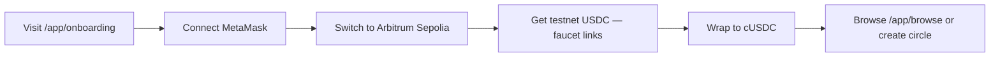

### Create Circle

1. `/app` → Create Circle with encrypted min contribution, max members, rounds, optional credit tier gate
2. Admin auto-joins; registered in KuraRoundOrder
3. Optional: `/app/privacy` → init vault as private circle

### Join Circle

1. `/app/browse` → select public circle OR receive invite
2. `joinCircle` — tier check via KuraCredit if gated
3. `/app/vault` → check encrypted membership

### Contribute

1. Wrap USDC → cUSDC; `setOperator(KuraCircle)`
2. `/app/contribute` → encrypt amount → submit
3. Decrypt own contribution via permit flow
4. KuraCredit records encrypted score increment

### Bid

1. `/app/bid` → encrypt bid amount (discount willing to accept)
2. Admin closes round → threshold decrypt lowest bid
3. Admin settles with verified signature

### Claim (Escrow)

1. Admin creates winner escrow via KuraEscrowAdapter
2. Winner meets credit condition via KuraConditionResolver
3. `claimEscrow` or `claimEscrowWithProof` with CoFHE signature

### Governance

1. `/app/governance` → create proposal
2. Members encrypt and submit votes
3. Admin closes with `closeVoteBatch` + threshold signatures
4. Non-voters can prove absence via `getEncVoteAbsenceProof`

### Dispute

1. `/app/dispute` → raise with encrypted claim
2. Admin `checkDisputeValidity` (sees ebool only)
3. Admin approve/reject blind
4. Claimant decrypts own amount

### Privacy Vault

1. Initialize vault → store encrypted name/description chunks
2. Grant member read access
3. Members decrypt handles client-side

### Stream Payments

1. Authorize KuraStreamPay operator on cUSDC
2. Create stream with encrypted rate × maxBlocks
3. Collect periodically; cancel for encrypted refund

### Credit Score

1. `/app/credit` → view encrypted score, squared weight, tier proofs
2. `verifyTierInRange` for bracket membership without revelation

### Member Registry

1. `/app/vault` → `allowMemberSelf(circleId, slot)`
2. Decrypt own slot handle
3. Circle protocol uses `getRandomSlotIndex` for encrypted winner selection

---

## Protocol Statistics

| Metric | Count | Notes |
|---|---|---|
| Total KURA protocol contracts | **13** | 6 Wave 4 + 7 Wave 1–3 core |
| New contracts (Wave 4) | **6** | MemberRegistry, CreditV2, PrivacyVault, StreamPay, Dispute, Governance |
| Updated contracts (Wave 4 fixes) | **4** | KuraCredit, KuraBid, KuraEscrowAdapter, KuraMemberRegistry |
| External deployed contracts | **3** | ConfidentialEscrow, cUSDC, USDC |
| **Total deployed addresses** | **15** | All on Arbitrum Sepolia |
| **FHE operations used** | **16** | Complete wave4 spec |
| New FHE ops (Wave 4) | **3** | `rem`, `not`, `verifyDecryptResultBatch` |
| FHE-enabled contracts | **10** | Across Waves 1–4 |
| New frontend routes (Wave 4) | **8** | vault, privacy, stream, dispute, governance, circles, browse, onboarding |
| New frontend hooks (Wave 4) | **8** | One hook per Wave 4 contract + useConfidentialUSDC + useMyCircles |
| Total frontend routes | **16** | 8 Wave 4 + 8 Wave 1–3 / utility |
| Total frontend hooks documented | **13** | 8 new + 5 existing |
| Test suite files | **10** | `test/*.test.ts` |
| Tests passing | **86** | `@cofhe/hardhat-plugin` mocks |
| Tests pending | **15** | Require real Fhenix network |
| Wave 4 bug fixes | **7** | Contract + compiler fixes |
| Wave 5 live fix commits | **7** | Gas, iframe, ABI, UI guards |
| Confirmed live transactions | **7** | Captured tx hashes on Sepolia |
| Failed intermediate txs (fixed) | **3** | Pre-ABI-fix `status=0x0` reverts |
| Verified live workflows | **13** | Wave 5 live audit table |

---

## Quick Start

```bash
# Install
cd d:\route\kura && npm install

# Compile
npx hardhat compile

# Test
npx hardhat test

# Frontend
cd frontend && bun install && bun run dev
# → http://localhost:5173

# Environment (.env)
# PRIVATE_KEY=<deployer-key>
# ARBISCAN_API_KEY=<arbiscan-key>
```

Connect MetaMask to **Arbitrum Sepolia** (chainId **421614**).

---

*Generated from KURA Protocol Wave 4 Complete Reference and Wave 5 Live Test Summary. All contracts compiled, deployed 2026-05-03, frontend updated and validated on Vercel 2026-05-27.*
